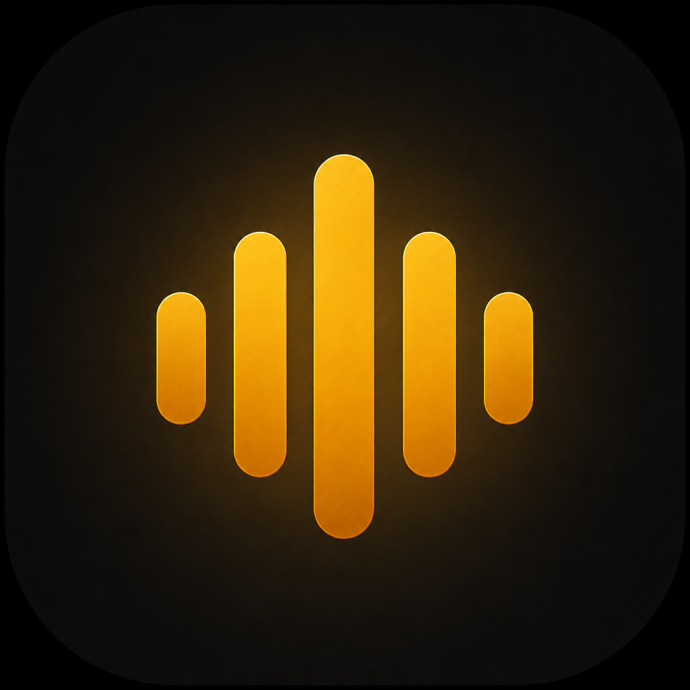
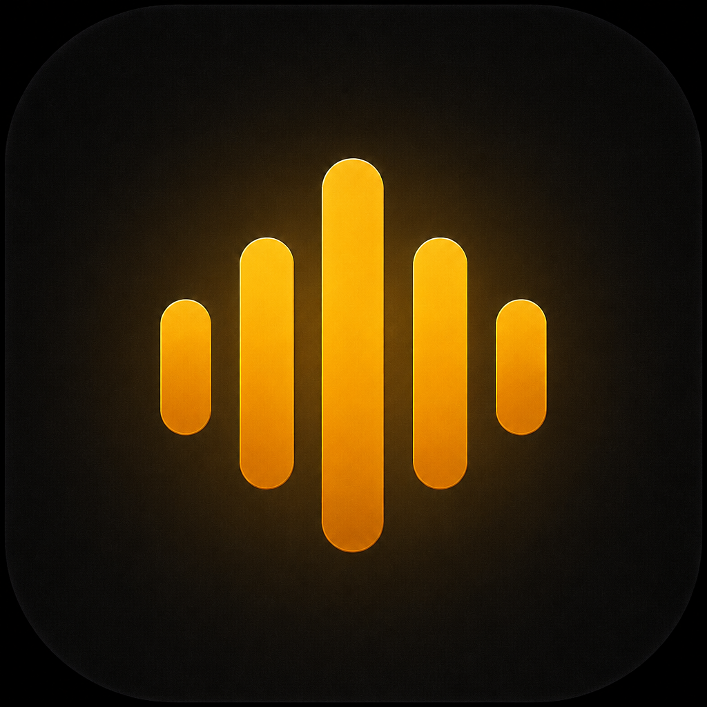

<p align="center">
  
</p>

<h1 align="center">Iris Flow</h1>

<p align="center">
  <strong>Open-source macOS speech-to-text overlay</strong><br />
  Hold Left-Ctrl, speak, and text lands in whatever app you are using.
</p>

<p align="center">
  
  
  
</p>

## TL;DR

Iris Flow is a local Mac app. Clone it, install once, paste your own API keys, then open it from Applications. No account. No hosted backend. Hold **Left-Ctrl** to dictate into Notes, browsers, Slack, editors — any app that takes text.

```bash
git clone https://github.com/joyboy5477/IrisFlow.git
cd IrisFlow/Irisflow
npm install
npm run install:mac
```

Then open **Irisflow** from Applications. You do not run npm again after that.

## Devices

| Works | Does not work |
|---|---|
| macOS 11 or later | Windows |
| Apple Silicon — M1, M2, M3, M4 | Intel Macs |
| | Linux |

You need **Node.js 18+** and **Xcode Command Line Tools** (`xcode-select --install`) to build.

## Works in

Iris Flow types into the app that is focused. Typical use:

- Notes, TextEdit, Mail, Messages
- Chrome, Safari, Arc, and other browsers
- Slack, Discord, Linear, Notion
- VS Code, Cursor, Xcode, Terminal

If you can type in it, you can dictate into it.

## Features

- **Dictation** — AI mode off. Speak, release, the transcript is pasted at the cursor.
- **AI mode** — Select text anywhere, hold Left-Ctrl, speak a request. The answer is copied (⌘V to paste).
- **Your models** — Cerebras (default), OpenAI, or Claude, using keys you paste in the app.
- **Documents** — Upload PDFs and notes. With a Google AI key, Iris Flow can search them in AI mode.
- **Local data** — Chats, files, and keys stay on this Mac. Keys are encrypted with macOS Keychain.

<p align="center">
  
</p>

## Install

**Once.** After this, launch Irisflow from Spotlight, the Dock, or Applications.

1. Install [Node.js 18+](https://nodejs.org) (LTS).
2. Install Command Line Tools if `swiftc` is missing:

   ```bash
   xcode-select --install
   ```

3. Clone and build:

   ```bash
   git clone https://github.com/joyboy5477/IrisFlow.git
   cd IrisFlow/Irisflow
   npm install
   npm run install:mac
   ```

4. Finder → **Applications** → right-click **Irisflow** → **Open** → **Open** (unsigned build; a normal double-click may be blocked the first time).
5. Allow **Microphone**.
6. **System Settings → Privacy & Security → Accessibility** → enable **Irisflow**. Quit and reopen the app.
7. In Iris Flow, open **Keys** and paste a **Deepgram** key.

## How to use

1. Open Iris Flow (the gold bar stays on the edge of the screen).
2. Click into any text field.
3. Hold **Left-Ctrl**, speak, release.
4. Dictation: the words appear at the cursor. AI mode: copy the answer with ⌘V.

**Keys** (all yours, stored only on this Mac):

| Key | Used for |
|---|---|
| [Deepgram](https://console.deepgram.com/) | Speech to text (required) |
| [Cerebras](https://cloud.cerebras.ai/), [OpenAI](https://platform.openai.com/api-keys), or [Anthropic](https://console.anthropic.com/settings/keys) | AI mode |
| [Google AI](https://aistudio.google.com/apikey) | Searching uploaded documents |

Iris Flow runs entirely on your Mac. You only paste API keys for speech and AI.

## License

[MIT](Irisflow/LICENSE)
